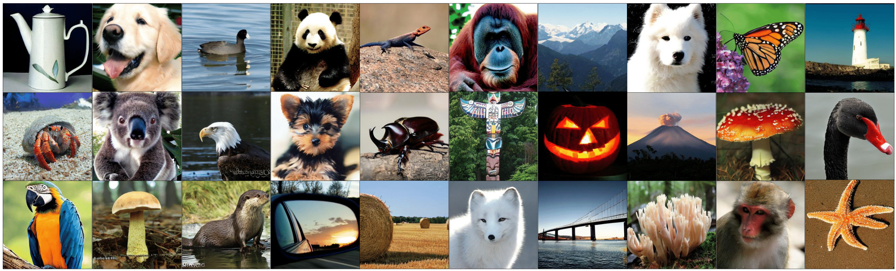
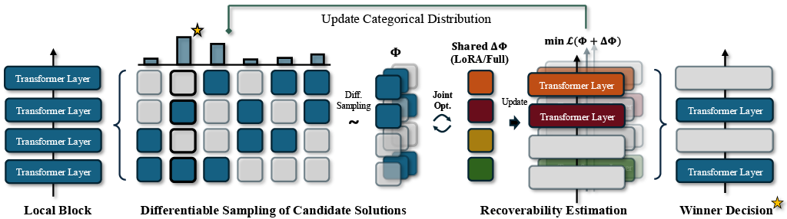
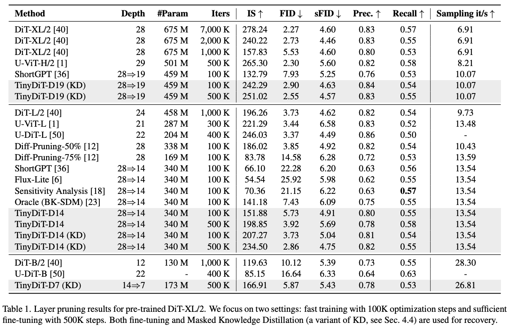
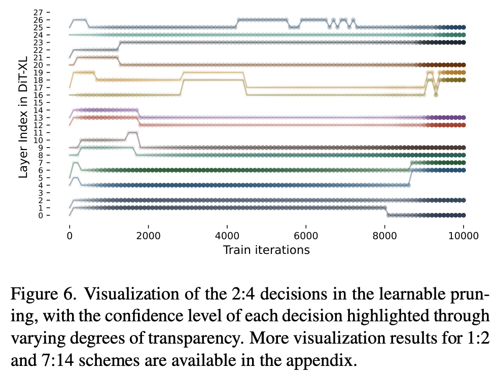
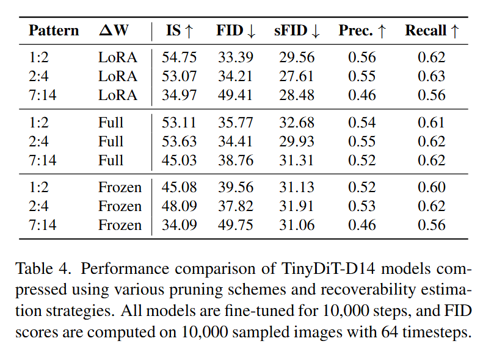
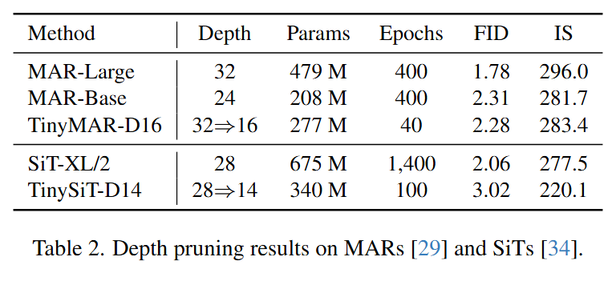

<div align="center">

<h1> TinyFusion </h1>

<div align="center">
 
  <em>
      Images generated by TinyDiT-D14 on ImageNet, pruned and distilled from a DiT-XL/2. It achieves a 2x speedup  using less than 7% of the original pre-training cost.
  </em>
</div>

<h3>TinyFusion: Diffusion Transformers Learned Shallow</h3>


[Gongfan Fang](https://fangggf.github.io/)†, [Kunjun Li](https://kunjun-li.github.io/)†, [Xinyin Ma](https://horseee.github.io/), [Xinchao Wang](https://sites.google.com/site/sitexinchaowang/)  
 
[National University of Singapore](https://nus.edu.sg/) 

*†: Equal Contribution*

📄 [[Arxiv]](https://arxiv.org/abs/2412.01199)
</div>

## 0. Learn a Shallow Diffusion Transformers

This work presents TinyFusion, a learnable **depth pruning** method for diffusion transformers. We highlight the following key findings:

* 💡 **Is calibration loss a reliable indicator?** Our [experiments](https://github.com/VainF/TinyFusion?tab=readme-ov-file#-is-calibration-loss-a-reliable-indicator) show that, pruned models with low calibration loss may not guarantee good post-finetuning performance.
* 🔑 **Optimizing the recoverability:** TinyFusion directly optimizes the recoverability of the pruned model, which ensures better performance after fine-tuning.
* ⚡ **Training Efficiency:** The trainable parameters for pruning are only **~0.9%** of the original model, making the pruning process highly efficient.
* 📚 **Masked KD for Enchanced Recovery:**  For recovery, we propose [Masked Knowledge Distillation](https://github.com/VainF/TinyFusion?tab=readme-ov-file#masked-kd) that excludes [extreme activations](https://arxiv.org/abs/2402.17762) in DiTs during knowledge transfer, which significantly improves performance compared to standard fine-tuning.


<div align="center">
 
</div>

## 1. Quick Start with Pre-trained Models

### Requirements
```bash
pip install -r requirements.txt
```

### Download [pre-trained TinyDiT-D14](https://github.com/VainF/TinyFusion/releases/download/v1.0.0/TinyDiT-D14-MaskedKD-500K.pt) with 14 layers
```bash
mkdir -p pretrained && cd pretrained
wget https://github.com/VainF/TinyFusion/releases/download/v1.0.0/TinyDiT-D14-MaskedKD-500K.pt
```

### Sampling with pre-trained models
```bash
python sample.py --model DiT-D14/2 --ckpt pretrained/TinyDiT-D14-MaskedKD-500K.pt --seed 5464
```
<div align="center">

</div>

## 2. Preparation

### Extract ImageNet Features to enable fast training
```bash
torchrun --nnodes=1 --nproc_per_node=1 extract_features.py --model DiT-XL/2 --data-path data/imagenet/train --features-path data/imagenet_encoded
```

### Download Pre-trained DiT-XL/2

```bash
mkdir -p pretrained && cd pretrained
wget https://dl.fbaipublicfiles.com/DiT/models/DiT-XL-2-256x256.pt
```

## 3. Layer Pruning

### Learnable Pruning (Ours)

The script prune_by_learning.py allows users to prune and derive shallow versions of specific models. To learn a shallow DiT with 14 layers, we use the following script:

```bash
torchrun --nnodes=1 --nproc_per_node=8 prune_by_learning.py \
  --model DiT-XL-1-2 \
  --load-weight pretrained/DiT-XL-2-256x256.pt \
  --data-path data/imagenet_encoded \
  --epochs 1 \
  --global-batch-size 128 \
  --delta-w \
  --lora \
  --save-model outputs/pruned/DiT-D14-Learned.pt
```

#### Command Arguments

- `--model`: Specifies the model to be pruned. DiT-XL-1-2 will learn a 14 layer model with the block size of 2, where one layer will be removed from each block.

- `--data-path`: Path to the encoded ImageNet.  

- `--delta-w`: Allow weight udpates during decision optimization.

- `--lora`: Uses LoRA (Low-Rank Adaptation) for weight updates. If not specified, full fine-tuning will be used.

- `--save-model`: Path to save the pruned model.

#### Available Models

The script supports multiple models, each designed for specific pruning strategies. Below are the pre-defined options:

```bash
  DiT_XL_1_2,  # XL with 1:2 pruning => D14
  DiT_XL_2_4,  # XL with 2:4 pruning => D14
  DiT_XL_7_14, # XL with 7:14 pruning => D14
  DiT_XL_1_4,  # XL with 1:4 pruning => D7
  DiT_D14_1_2, # D14 with 1:2 pruning => D7
  DiT_D14_2_4  # D14 with 2:4 pruning => D7
```
You can also customize your pruning patterns using the [`groups`](https://github.com/VainF/TinyFusion/blob/21f56f3408a31d6b7ebf5c5e83ed4dea7a4b529f/models_with_layer_pruning.py#L161) arguments. The following example crafts a hybrid pattern with 2:4 and 3:4 pruning, yielding a 16-layer model.
```bash
def DiT_XL_customized(**kwargs):
    return DiT(depth=28, hidden_size=1152, patch_size=2, num_heads=16, groups=[ [2,4], [2,4], [3,4], [2,4], [3,4], [2, 4], [2, 4] ], **kwargs)
```

### Pruning by BI Score (ShortGPT)

This script estimates the input and output similarity of each layer as the importance score. Please refer to [ShortGPT](https://arxiv.org/abs/2403.03853) for more details.

```bash
python prune_by_score.py --model DiT-XL/2 --ckpt pretrained/DiT-XL-2-256x256.pt --save-model outputs/pruned/DiT-D14-Score.pt --n-pruned 14
```

### Pruning with BK-SDM (Oracle) Scheme

[BK-SDM](https://github.com/Nota-NetsPresso/BK-SDM) keeps the first layers in each "encoder block" and the last layer in each "decoder block". For DiT, we treat the first 14 layers as the encoder and the last 14 layers as the decoder, and group every 2 layers as a block. The oracle pruning can be performed with:
```bash
python prune_by_index.py --model DiT-XL/2 --ckpt pretrained/DiT-XL-2-256x256.pt --kept-indices "[0, 2, 4, 6, 8, 10, 12, 14, 17, 19, 21, 23, 25, 27]" --save-model outputs/pruned/DiT-D14-Oracle.pt
```

### Pruning by Indices
To prune a model with predefined indices, use the following command:
```bash
python prune_by_index.py --model DiT-XL/2 --ckpt pretrained/DiT-XL-2-256x256.pt --save-model outputs/pruned/DiT-D14-by-Score.pt --kept-indices "[0, 1, 2, 3, 4, 5, 6, 7, 8, 9, 10, 11, 12, 13]"
```

## 4. Fine-tuning

### Standard Finetuning
```bash
torchrun --nnodes=1 --nproc_per_node=8 train.py --model DiT-D14/2 --load-weight outputs/pruned/DiT-D14-Learned.pt --data-path data/imagenet_encoded --epochs 100 --prefix D14-Learned-Finetuning 
```

### Masked KD
Finetuning with the proposed Masked KD, which masks massive activations in the teacher's and student's hidden states. Please see the paper for more details.
```bash
# Masked KD
torchrun --nnodes=1 --nproc_per_node=8 train_masked_kd.py --model DiT-D14/2 --load-weight outputs/pruned/DiT-D14-Learned.pt --data-path data/imagenet_encoded --epochs 100 --prefix D14-Learned-RepKD --teacher DiT-XL/2 --load-teacher pretrained/DiT-XL-2-256x256.pt
```

<div align="center">

</div>


## 5. Sampling for Evaluation

### DDP Sampling
```bash
torchrun --nnodes=1 --nproc_per_node=8 sample_ddp.py --model DiT-D14/2 --ckpt outputs/D14-Learned-Finetuning/checkpoints/0500000.pt
```

### FID (Requires Tensorflow 2.0)

Please refer to [https://github.com/openai/guided-diffusion/tree/main/evaluations](https://github.com/openai/guided-diffusion/tree/main/evaluations) for the ``VIRTUAL_imagenet256_labeled.npz``.
```bash
python evaluator.py data/VIRTUAL_imagenet256_labeled.npz PATH_TO_YOUR.npz
```

## 6. Key Results

### 🚀 Results on DiT
<div align="center">
 
 <br>
</div>


### 🚀 The dynamics of decisions during pruning
<div align="center">
 
 <br>
</div>


### 🚀 Is calibration loss a reliable indicator?
<div align="center">
 
 <br>
</div>

### 🚀 Different pruning strategies and patterns
We show that, incorporating the recoverability estimation can bring performance benefits to downstream finetuning.
<div align="center">
 
 <br>
</div>

### 🚀 The extreme activations in DiTs
Masked KD removes extreme activations in DiTs for better and more stable knowledge transfer.
<div align="center">

 <br>
</div>

### 🚀 MARs and SiTs
We also extend our method to other models like [MARs](https://github.com/LTH14/mar) and [SiTs](https://github.com/willisma/SiT), and the results suggest TinyFusion exhibits strong generalization across diverse diffusion transformer achitectures.

<div align="center">
 
 <br>
</div>

## 7. Acknowledgments

This project is built on [facebookresearch/DiT](https://github.com/facebookresearch/DiT). We also use [NVlabs/MaskLLM](https://github.com/NVlabs/MaskLLM?tab=readme-ov-file) for Gumbel softmax, [openai/guided-diffusion](https://github.com/openai/guided-diffusion) for evaluation.


## 8. BibTeX
  
```bibtex
@article{fang2024tinyfusion,
  title={TinyFusion: Diffusion Transformers Learned Shallow},
  author={Fang, Gongfan and Li, Kunjun and Ma, Xinyin and Wang, Xinchao},
  journal={arXiv preprint arXiv:2412.01199},
  year={2024}
}
```
